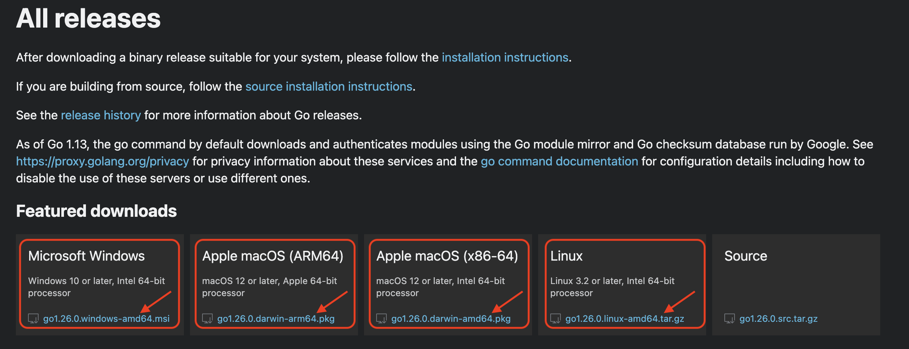

<div align="center">
    <h1>3) Setup</h1>
    <a class="header-badge" target="_blank" href="https://www.linkedin.com/in/abbasovdev/">
        
    </a>
    <a class="header-badge" target="_blank" href="https://x.com/abbcyhn">
        
    </a>
    <h2>Author: 
        <a href="https://www.linkedin.com/in/abbasovdev/" target="_blank">Jeyhun Abbasov</a>
    </h2>
    <div>
        <span>Interactive Learning</span>
        <br />
        <div align="left">
            ☰ <a href="../../../README.md">🏠 Home</a> 
            ┃ <a href="../01_go_philosophy/README.md"> ⬅&#xFE0E; Previous Topic</a>
            ┃ <a href="../03_how_to_use/README.md"> Next Topic ⮕&#xFE0F;</a>
        </div>
        
        <br />
    </div>
</div>

---

## Setup

You will learn how to setup the Go environment.

### Install IDE

You can use any IDE you want.

But I recommend using either [VS Code](https://code.visualstudio.com/) or [Cursor](https://www.cursor.com/).

### Install Go

↳ 1) Go to the [official website](https://go.dev/dl/) 

↳ 2) Download the latest version of Go for your operating system.



↳ 3) Open the package file you downloaded and follow the prompts to install Go.

### Verify the Installation

↳ 1) Open a terminal 

↳ 2) Run the following command to verify the installation:
```bash
go version
```

If you are a beginner and stuck in any step ping me on [X](https://x.com/abbcyhn) or [LinkedIn](https://www.linkedin.com/in/abbasovdev/). Happy to help you.

## Conclusion

Now you know how to setup the environment to learn Go.

Continue to the next topic 👇

[How to Use This Repo ⮕&#xFE0F;](../03_how_to_use/README.md)