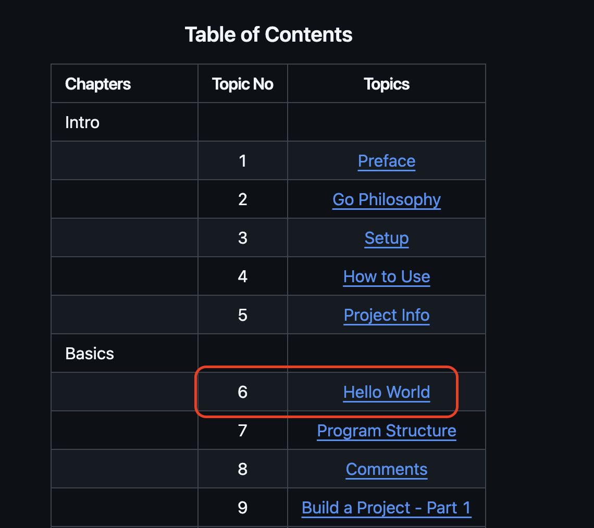

<div align="center">
    <h1>4) How to Use this Repo</h1>
    <a class="header-badge" target="_blank" href="https://www.linkedin.com/in/abbasovdev/">
        
    </a>
    <a class="header-badge" target="_blank" href="https://x.com/abbcyhn">
        
    </a>
    <h2>Author: 
        <a href="https://www.linkedin.com/in/abbasovdev/" target="_blank">Jeyhun Abbasov</a>
    </h2>
    <div>
        <span>Interactive Learning</span>
        <br />
        <div align="left">
            ☰ <a href="../../../README.md">🏠 Home</a> 
            ┃ <a href="../02_setup/README.md"> ⬅&#xFE0E; Previous Topic</a>
            ┃ <a href="../04_project_info/README.md"> Next Topic ⮕&#xFE0F;</a>
        </div>
        
        <br />
    </div>
</div>

---

## How to Use this Repo

Starting from the `Basics` chapter, you will read less words and write more code.

There will be a task in each topic to test your knowledge.

You will open `main.go` file in the topic directory and write your code.

To run a `main.go` file in the topic directory, first you need to navigate to the topic directory.

For example, to run the `Hello World` topic, you need to navigate:
```bash
cd chapters/02_basics/01_hello_world
```

then you can run the code via:
```bash
go run main.go
```

It is a bit tedious to navigate between the directories to run the code.

### Run Code Without Navigating

You can run any `main.go` file in the topic directory without leaving the root directory.

You just need to run the following command:

```bash
go run topic.go <topic number>
```

`<topic number>` is the number of the topic you want to run. 

For example, to run the `Hello World` topic, you need to run:

```bash
go run topic.go 6
```

Why "6" ? Recall the table of contents:


You don't need to memorize the topic numbers.

I will tell you in each topic how to run the code.

# Validate the Code

There is also a way to validate the code.

It basically runs your code and checks if the output is correct.

You just need to add `validate` to the command:
```bash
go run topic.go <topic number> validate
```

For example, to validate the `Hello World` topic, you need to run:
```bash
go run topic.go 6 validate
```

# Solution Branch

Every exercise has a completed solution on the `solution` branch. If you are stuck compare your code with the solution without switching branches:

```bash
git diff main..solution -- chapters/02_basics/01_hello_world/main.go
```

Replace the path with the topic you are working on.

## Conclusion

Sorry to bore you with this 🙂

But I wanted to make sure you understand how things work in the repo.

Now you know how to use the repository to learn Go.

Continue to the next topic 👇

[Project Info ⮕&#xFE0F;](../04_project_info/README.md)